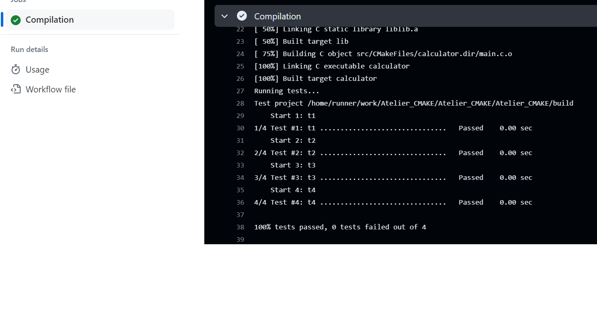

------------------------------------------------------------------------------------------------------
PROJET AUTOMATISATION DES TESTS
------------------------------------------------------------------------------------------------------
Quelles sont les notions qui vont être abordées au cours de cet atelier ?
Cet atelier a pour objectif de vous apprendre à créer des actions Github pour automatiser vos tests. Vous allez, sur la base de cette calculatrice écrite en code C, compiler puis executer automatiquement une serie de tests pour vérifier le bon focntionne de votre application. 
  
-------------------------------------------------------------------------------------------------------
Séquence 1 : GitHUB
-------------------------------------------------------------------------------------------------------
Objectif : Création d'un Repository GitHUB  
Difficulté : Très facile (~10 minutes)
-------------------------------------------------------------------------------------------------------
GitHUB est une plateforme en ligne utilisée pour stocker le code de son programme.
GitHUB est organisé en "Repository", c'est à dire en répertoire (contenant lui même des sous répertoires et des fichiers). Chaque Repository sera indépendant les un des autres. Un Repository doit être vu comme un projet unique (1 Repository = 1 Projet). GitHUB est une plateforme très utilisée par les informaticiens.

**Procedure à suivre :**  
1° - Créez vous un compte sur GitHub : https://github.com/  
Si besoin, une vidéo pour vous aider à créer votre propre compte GitHUB : [Créer un compte GitHUB](https://docs.github.com/fr/get-started/onboarding/getting-started-with-your-github-account)  
A noter que **si vous possédez déjà un compte GitHUB, vous pouvez le conserver pour réaliser cet atelier**. Pas besion d'en créer un nouveau.  
Remarque importante : **Lors de votre inscription, utilisez une adresse mail valide. GitHUB n'accepte pas les adresses mails temporaires**  

2° - Faites un Fork du Repository suivant : [https://github.com/OpenRSI/flask_hello_world.git](https://github.com/OpenRSI/Atelier_CMAKE.git)  
Voici une vidéo d'accompagnement pour vous aider dans les "Forks" : [Forker ce projet](https://youtu.be/p33-7XQ29zQ)    
  
**Travail demandé :** Créé votre compte GitHUB, faites le fork de ce projet et **copier l'URL de votre Repository GitHUB dans la discussion public**.

Notion acquise lors de cette séquence :  
Vous avez appris lors de cette séquence à créer des Repository pour stocker et travailler avec votre code informatique. Vous pourez par la suite travailler en groupe sur un projet. Vous avez également appris à faire des Forks. C'est à dire, faire des copies de projets déjà existant dans GitHUB que vous pourrez ensuite adapter à vos besoins.
  
---------------------------------------------------
Séquence 2 : Création d'une action GitHub
---------------------------------------------------
Objectif : Créer un script pour automatiser vos tests 
Difficulté : Simple (~20 minutes)
---------------------------------------------------

Dans votre repository GitHUB, créer un fichier **.github/workflows/tests.yml** et y copier le code suivant :
```
name: Automatisation des tests
on: push
jobs:
  Compilation:
    runs-on: ubuntu-latest
    steps:
      - name: Compilation
        run: |
          last_directory=$(basename ${{ runner.workspace }})
          git clone https://github.com/${{ github.repository }}.git
          cd ./$last_directory
          mkdir build
          cd build
          cmake ..
          make
          make test
```
C'est fini !  
La serie de tests présent dans votre fichier CMakeLists.txt à la racine de votre projet sera automatiquement executé à chaque Commit de votre projet (à chaque modification)  
```
add_test(t1 src/calculator add 2 3)
add_test(t2 src/calculator sub 3 -2)
add_test(t3 src/calculator mul 5 5)
add_test(t4 src/calculator div 1 5)
```

Vous pouvez observer le résutat dans les log de votre Action :  
  


**Travail demandé**  
Créer votre première Action GitHub et observez le résultat dans les log de vos Actions.  

**Notions acquises de cette séquence**    
Vous avez vu dans cette séquence comment créer des Actions GiHUB pour automatiser vos tests.  
Dans le script que nous venons de voir à l'instant, celui-ci compile le code C dans un premier temps puis exécute une série de tests présent dans le fichier CMakeLists.txt.  

---------------------------------------------------------------------------------------------
Séquence 3 : Les Actions GitHUB (Industrialisation Continue)
---------------------------------------------------------------------------------------------
Objectif : Automatiser la mise à jour de votre hébergement Alwaysdata  
Difficulté : Moyenne (~15 minutes)
---------------------------------------------------------------------------------------------
Dans le Repository GitHUB que vous venez de créer précédemment lors de la séquence 1, vous avez un fichier intitulé CICD.yml et qui est déposé dans le répertoire .github/workflows. Ce fichier a pour objectif d'automatiser le déploiement de votre code sur votre site Alwaysdata. Pour information, c'est ce que l'on appel des Actions GitHUB. Ce sont des scripts qui s'exécutent automatiquement lors de chaque Commit dans votre projet (C'est à dire à chaque modification de votre code). Ces scripts (appelés actions) sont au format yml qui est un format structuré proche de celui d'XML.  

Pour utiliser cette Action (CICD.yml), **vous avez besoin de créer des secrets dans GitHUB** afin de ne pas divulguer des informations sensibles aux internautes de passage dans votre Repository comme vos login et password par exemple.  

Pour ce projet Métriques, **vous avez 4 secrets à créer** dans votre Repository GitHUB :  
**USERNAME** = Le login qui est utilisé pour la connexion SSH.  
**PASSWORD** = Le mot de passe qui est utilisé pour la connexion SSH.  
**ALWAYSDATA_TOKEN** = Le token est à créer depuis l'interface d'administration Alwaysdata. Cliquez sur votre profil en haut à droite, puis sur 'Profil' puis sur 'Gérer les tokens'. Laissez le champ "Adresses IP autorisées" vide. Dans le cas contraire vous limiteriez les connexions seulement à une adresse IP. Pour le champ Application* mettez "Metriques" par exemple.  
**ALWAYSDATA_SITE_ID** = Vous trouverez l'ID de votre site depuis l'interface d'administration Alwaysdata dans les paramètres de votre site (dans le titre #XXXXX) XXXXX étant l'ID de votre site. Ne prenez pas le # mais juste les chiffres.  
  
Voici une vidéo pour vous expliquer le processus de création de vos secrets dans GitHUB : [Création des secrets](https://youtu.be/pi80zRdrJyQ)  
Vous pouvez à présent **lancer une action pour mettre en ligne votre solution**.  
  
Notions acquises de cette séquence :  
Vous avez vu dans cette séquence comment créer des secrets GiHUB afin de mettre en place de l'industrialisation continue.  
L'utilité des scripts d'actions (C'est à dire des scripts exécutés lors des Commits) est très importante mais sortes malheureusement du cadre de cet atelier faute de temps. Toutefois, je vous invites à découvrir cet outil via les différentes sources du Web (Google, ChatGPT, etc..).  

---------------------------------------------------
Séquence 4 : Créer la base de données sur votre serveur
---------------------------------------------------
Objectif : Créer la base de données SQLite sur votre serveur  
Difficulté : Faible (~10 minutes)
---------------------------------------------------
1° - Connectez vous en SSH à votre serveur Alwaysdata via l'adresse suivante :**https://ssh-{compte}.alwaysdata.net**. Remarque importante, {compte] est à remplacer par votre compte Alwaysdata. C'est à dire le compte que vous avez utilisé pour renseigner votre secret GitHUB USERNAME.   
2° - Une fois connecté, depuis de la console SSH, executez la commande suivante : **cd www/flask** puis **python3 create_db.py**  
Votre base de données est à présent opérationnelle sur votre serveur (Le fichier database.db à été créé dans votre répertoire sur le serveur)
Vous pouvez, si vous le souhaitez, tappez la commande **ls** dans votre console pour voir la présence de la base de données.

LES ROUTES (API)
-------------------------------------------
Votre solution est à présent opérationnelle. Vous pouvez testez les routes (API) comme suit :  
  
https://{Votre_URL}**/**  
Pointe sur le fichier helloWorld d'accueil  

https://{Votre_URL}**/lecture**  
L'accès est conditionné à un contrôle d'accès  

https://{Votre_URL}**/authentification**  
Page d'authentification (admin, password)  

https://{Votre_URL}**/fiche_client/1**  
Permet de faire un filtre sur un client. Vous pouvez changer la valeur de 1 par le N° du client de votre choix  

https://{Votre_URL}**/consultation/**  
Permet de consutler la base de données  

https://{Votre_URL}**/enregistrer_client**  
API pour enregistrer un nouveau client  

---------------------------------------------------
Séquence 5 : Exercices
---------------------------------------------------
Objectif : Travailler votre code  
Difficulté : Moyenne (~60 minutes)
---------------------------------------------------
**Exercice 1 : Création d'une nouvelle fonctionnalité**    
Créer une nouvelle route dans votre application afin de faire une recherche sur la base du nom d'un client.  
Cette fonctionnalité sera accéssible via la route suivante : **/fiche_nom/**  

**Exercice 2 : Protection**  
Cette nouvelle route "/fiche_nom/" est soumise à un contrôle d'accès User. C'est à dire différent des login et mot de passe administrateur.  
Pour accéder à cette fonctionnalité, l'utilisateur sera authentifié sous les login et mot de passe suivant : **user/12345**
  
---------------------------------------------------
Séquence 6 : Le projet de bibliothèque
---------------------------------------------------
Objectif : Créer une application de biliothèque  
Difficulté : Moyenne (~180 minutes)
---------------------------------------------------
Votre projet consiste à present à concevoir et développer une application de gestion de bibliothèque moderne qui simplifie le processus de prêt et de retour de livres. Les fonctionnalités attendues dans le cadre de ce projet sont les suivantes :  
•	L’enregistrement et la suppression de livres.  
•	La recherche de livres disponibles.  
•	L'emprunt possible d'un livre par un utilisateur.  
•	La gestion des utilisateurs.  
•	La gestion des stocks.  
Votre travail est de modifier votre code afin de répondre aux besoins définis ci-dessus.
L'application exploitera des API pour interagir avec la base de données et un contrôle d'accès Utilisateur/Administrateur doit être mis en place.  
L’application pourra être enrichie avec des fonctionnalités supplémentaires telles que des recommandations de livres, des notifications pour les retours en retard, ou encore des rapports statistiques sur l'utilisation des livres pour améliorer l'expérience utilisateur et la gestion de la bibliothèque.  
